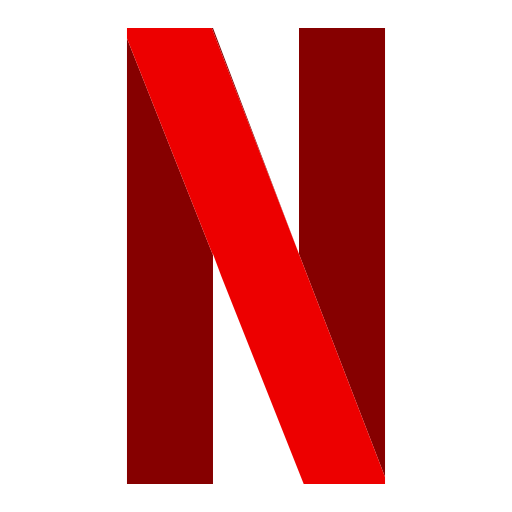

<a name="readme-top"></a>

[![MIT License][license-shield]][license-url]
[![LinkedIn][linkedin-shield]][linkedin-url]


<!-- PROJECT LOGO -->
<br />
<div align="center">
  <a href="https://github.com/othneildrew/Best-README-Template">
    
  </a>

  <h3 align="center">Netflix Clone</h3>

  <p align="center">
    Cause Why Not!
    <br />
    <a href="https://github.com/amir002001/netflix-clone/issues">Report Bug</a>
    ·
    <a href="https://github.com/amir002001/netflix-clone/issues">Request Feature</a>
  </p>
</div>


<!-- TABLE OF CONTENTS -->
<details>
  <summary>Table of Contents</summary>
  <ol>
    <li>
      <a href="#about-the-project">About The Project</a>
      <ul>
        <li><a href="#gallery">Gallery</a></li>
        <li><a href="#built-with">Built With</a></li>
      </ul>
    </li>
    <li>
      <a href="#getting-started">Getting Started</a>
      <ul>
        <li><a href="#prerequisites">Prerequisites</a></li>
        <li><a href="#installation">Installation</a></li>
      </ul>
    </li>
    <li><a href="#contributing">Contributing</a></li>
    <li><a href="#license">License</a></li>
    <li><a href="#contact">Contact</a></li>
  </ol>
</details>


## About The Project


This is a clone I made for netflix using a few libraries mentioned below! It has auth with firebase and it uses the TMDB API. The website is mobile-first and is fullt responsive ⚡️✨

### Gallery
<details>
    <summary>Click Me</summary>

   
   
   
  </details>


<p align="right">(<a href="#readme-top">back to top</a>)</p>


### Built With

The application was built with the following technologies

* [![Next][Next.js]][Next-url]
* [![React][React.js]][React-url]
* [![Firebase][Firebase]][Firebase-url]
* [![Typescript][Typescript]][Typescript-url]
* [![Vercel][Vercel]][Vercel-url]


<p align="right">(<a href="#readme-top">back to top</a>)</p>


<!-- GETTING STARTED -->
## Getting Started

To get started with the project use the following steps :)

### Prerequisites

You're going to need npm!
* npm
  ```sh
  npm install npm@latest -g
  ```

### Installation

Follow these steps to install the project and add API keys.

1. Get a free API Key at [https://www.themoviedb.org](https://www.themoviedb.org/?language=en-CA)
2. Clone the repo
   ```sh
   git clone https://github.com/amir002001/netflix-clone.git
   ```
3. Install NPM packages
   ```sh
   npm install
   ```
4. create `.env.local` and enter your API in there as `NEXT_PUBLIC_TMBD_API_KEY` 
   ```js
   NEXT_PUBLIC_TMBD_API_KEY = <APIKEY>;
   ```

<p align="right">(<a href="#readme-top">back to top</a>)</p>


<!-- CONTRIBUTING -->
## Contributing

Contributions are what make the open source community such an amazing place to learn, inspire, and create. Any contributions you make are **greatly appreciated**.

If you have a suggestion that would make this better, please fork the repo and create a pull request. You can also simply open an issue with the tag "enhancement".
Don't forget to give the project a star! Thanks again!

1. Fork the Project
2. Create your Feature Branch (`git checkout -b feature/AmazingFeature`)
3. Commit your Changes (`git commit -m 'Add some AmazingFeature'`)
4. Push to the Branch (`git push origin feature/AmazingFeature`)
5. Open a Pull Request

<p align="right">(<a href="#readme-top">back to top</a>)</p>


<!-- LICENSE -->
## License

Distributed under the MIT License. See `LICENSE.txt` for more information.

<p align="right">(<a href="#readme-top">back to top</a>)</p>


<!-- CONTACT -->
## Contact

Amir Afshari - [@aazizafshari](https://twitter.com/aazizafshari) - [its@amirafshari.dev](mailto:its@amirafshari.dev)

Project Link: [https://github.com/amir002001/netflix-clone](https://github.com/amir002001/netflix-clone)

<p align="right">(<a href="#readme-top">back to top</a>)</p>


<!-- MARKDOWN LINKS & IMAGES -->
<!-- https://www.markdownguide.org/basic-syntax/#reference-style-links -->

[license-shield]: https://img.shields.io/github/license/othneildrew/Best-README-Template.svg?style=for-the-badge
[license-url]: https://github.com/amir002001/netflix-clone/blob/main/LICENSE.md
[linkedin-shield]: https://img.shields.io/badge/-LinkedIn-black.svg?style=for-the-badge&logo=linkedin&colorB=555
[linkedin-url]: https://linkedin.com/in/amir-afshar
[Next.js]: https://img.shields.io/badge/next.js-000000?style=for-the-badge&logo=nextdotjs&logoColor=white&color=black
[Next-url]: https://nextjs.org/
[React.js]: https://img.shields.io/badge/React-20232A?style=for-the-badge&logo=react&logoColor=61DAFB&color=black
[React-url]: https://reactjs.org/
[Firebase]: https://img.shields.io/badge/Firebase-039BE5?style=for-the-badge&logo=Firebase&logoColor=rgb(255,203,49)&color=black
[Firebase-url]: https://firebase.google.com/
[Typescript]: https://img.shields.io/badge/TypeScript-007ACC?style=for-the-badge&logo=typescript&logoColor=white&color=black
[Typescript-url]: https://www.typescriptlang.org/
[Vercel]: https://img.shields.io/badge/vercel-%23000000.svg?style=for-the-badge&logo=vercel&logoColor=white
[Vercel-url]: https://vercel.com
